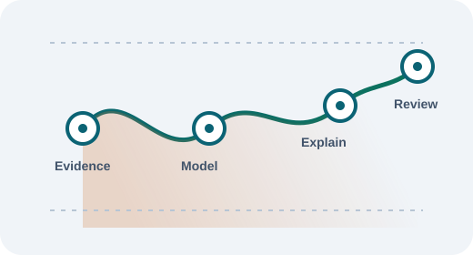

# TruthLens AI

TruthLens AI is a research-oriented platform for transparent fake-news classification research in Indian digital-media contexts. **Phase 4 is complete and Phase 5.4 is complete.** The repository now includes the Phase 4.6 publication package, a production-quality frontend hardening pass, a bounded prediction/explainability workflow, and an industrial analytics/research dashboard.

## Research status

`TL-LSVM-TFIDF-v1.1.0-rc.1` is the final **internal research champion**: TF-IDF unigram/bigram plus LinearSVC, integrated through an integrity-checked package. It is not a production model (`production_model=false`) and has no post-tuning protected-test result.

| Evidence | Result |
| --- | --- |
| Frozen validation performance | Macro F1 0.5398; MCC 0.1014; FAKE recall 0.3183 |
| Best evaluated alternative | Hard/weighted ensemble Macro F1 0.5447, within the 0.005 practical-tie tolerance |
| Explainability | Bounded SHAP/LIME explanations of the uncalibrated LinearSVC margin |
| Transformer benchmark | No completed candidate metric: access/resource limited |
| Multilingual assessment | Unicode compatibility only; no validated Hindi/Hinglish fake-news performance |
| Reliability assessment | Capitalization and neutral expansion flip 29.0% and 27.0% of validation predictions |
| Calibration | Unavailable; sigmoid ECE/Brier values are non-fitted proxies, not confidence |

The model must not be described as a fact checker, factual-verdict tool, calibrated probability model, general Indian-media reliability assessor, Hindi/Hinglish detector, or autonomous moderation system. Public deployment remains blocked pending new governed data/model scope, post-tuning evaluation, calibration, robustness/fairness, rights, monitoring, and human-review evidence.

## Current architecture

```text
Frontend (HTML / CSS / JavaScript)
        ↓ public API
Node.js Backend (Express: validation, API envelope, timeout/retry)
        ↓ private API
Python ML Microservice (FastAPI: readiness, metadata, integrity-checked inference + XAI)
        ↓
Versioned internal candidate package (preprocessing + TF-IDF + LinearSVC)
```

The browser never calls the ML service directly. The response exposes an uncalibrated `decision_score`; `confidence` remains unavailable and `risk_level` is not assessed. Optional explanation metadata describes the model margin, not factual truth or confidence.

## Frontend foundation

Phase 5.1 adds a dependency-free single-page application shell under `frontend/`. Phase 5.2 completes the core `/predict` experience: validated headline/article input, loading/reset/error states, response trace metadata, explicit unavailable confidence, and optional bounded SHAP/LIME contribution panels. Phase 5.3 makes `#/dashboard` an industrial analytics and research workspace with frozen evidence charts and on-demand public service checks. Phase 5.4 hardens the existing frontend with route-level lazy loading and skeletons, recoverable not-found/failure states, accessible focus and form feedback, dismissible severity-aware notifications, responsive QA, safe DOM rendering, and resilient API presentation. It does not change backend or ML behaviour, and “production-quality frontend” does not mean the research model is production approved.

- [Frontend documentation](docs/frontend/README.md)
- [UI guidelines](docs/frontend/UI_GUIDELINES.md)
- [Design system](docs/frontend/DESIGN_SYSTEM.md)
- [Component library](docs/frontend/COMPONENT_LIBRARY.md)
- [Frontend architecture](docs/frontend/FRONTEND_ARCHITECTURE.md)
- [Responsive design](docs/frontend/RESPONSIVE_DESIGN.md)
- [Prediction dashboard](docs/frontend/PREDICTION_PAGE.md)
- [Frontend API integration](docs/frontend/API_INTEGRATION.md)
- [Explainability UI guide](docs/frontend/XAI_UI_GUIDE.md)
- [Analytics dashboard](docs/frontend/ANALYTICS_DASHBOARD.md)
- [Chart guidelines](docs/frontend/CHART_GUIDELINES.md)
- [Analytics UI component reference](docs/frontend/UI_COMPONENT_REFERENCE.md)
- [Visual asset inventory](docs/frontend/VISUAL_ASSET_INVENTORY.md)
- [Accessibility guide](docs/frontend/ACCESSIBILITY_GUIDE.md)
- [Performance optimization](docs/frontend/PERFORMANCE_OPTIMIZATION.md)
- [UX review](docs/frontend/UX_REVIEW.md)
- [Responsiveness report](docs/frontend/RESPONSIVENESS_REPORT.md)
- [Frontend hardening](docs/frontend/FRONTEND_HARDENING.md)
- [Frontend quality assurance](docs/frontend/QUALITY_ASSURANCE.md)

The UI intentionally shows **Confidence unavailable** rather than a percentage, labels the decision score as an uncalibrated margin, treats missing XAI as unavailable, and does not make a Hindi/Hinglish, fact-checking, or production-readiness claim. URL analysis remains a disabled placeholder because it is not supported by the current API contract.

## Analytics dashboard

The `#/dashboard` route presents a portfolio-ready research and operational overview: project/model trace, frozen validation comparisons, dataset composition, train-only aggregate SHAP terms, research-insight cards, a no-retention recent-predictions state, and a user-triggered status check for the existing public backend/ML/model endpoints. The prediction distribution is visibly marked illustrative because the project does not retain prediction history; database monitoring is visibly marked not instrumented.



The illustration is a local placeholder for a future approved dashboard screenshot. It is not a product screenshot or a source of research evidence. See the [visual asset inventory](docs/frontend/VISUAL_ASSET_INVENTORY.md) for provenance and licence information.

## Phase 4 milestones

| Milestone | Outcome |
| --- | --- |
| 4.1 | Explainable AI: SHAP/LIME model-behaviour evidence without changing the champion |
| 4.2 | Transformer benchmark protocol; no completed transformer result |
| 4.3 | Classical ensembles: bounded validation trade-off analysis; no champion change |
| 4.4 | Unicode/Hindi/Hinglish processing audit; no multilingual classifier claim |
| 4.5 | Robustness, calibration-proxy, slice, error, and inference-only ablation assessment |
| 4.6 | Research finalization, publication artifacts, reproducibility, and documentation QA |

## Phase 5 milestones

| Milestone | Outcome |
| --- | --- |
| 5.1 | Professional UI/UX foundation: design system, reusable components, responsive app shell, prepared routes, and frontend documentation |
| 5.2 | Prediction and explainability dashboard: validated existing-API workflow, status/error handling, governed model trace, and bounded XAI visualization |
| 5.3 | Industrial analytics and research dashboard: evidence-aware charts, on-demand public status checks, reusable analytics components, and local SVG assets |
| 5.4 | Production UX, performance, accessibility, responsiveness, security, and maintainability hardening of the existing frontend; no backend/ML/model change |

## Publication and research documentation

- [Phase 4 publication package](docs/research/publication/README.md)
- [Project research summary](docs/research/PROJECT_RESEARCH_SUMMARY.md)
- [Phase 4 summary](docs/PHASE4_SUMMARY.md)
- [Final results tables](docs/research/publication/FINAL_RESULTS_TABLES.md)
- [Final comparison tables](docs/research/publication/FINAL_COMPARISON_TABLES.md)
- [Model Card](docs/research/MODEL_CARD.md) and [Data Card](docs/research/DATA_CARD.md)
- [Experiment Registry](docs/research/EXPERIMENT_REGISTRY.md) and [Model Registry](docs/research/MODEL_REGISTRY.md)
- [Research Decision Log](research/decision-log/README.md), [Engineering Journal](docs/engineering-journal/README.md), and [ADRs](docs/adr/README.md)

## Project structure

- `frontend/` - static application shell, reusable CSS/JS components, route renderers, and frontend tests
- `backend/` - public Node.js API and ML-service client
- `ml-service/` - FastAPI inference service and Git-ignored versioned packages
- `ml/` - research protocols, multilingual/reliability harnesses, fixtures, and machine-readable registry
- `docs/research/` - reports, cards, figures, and publication package
- `research/decision-log/` - methodological governance evidence

## Verification

See the [reproducibility guide](docs/research/publication/REPRODUCIBILITY_GUIDE.md) for immutable identifiers, environment detail, execution order, and the publication-package verification command. Do not regenerate completed work or change the frozen protocol without a new governed decision.

## Roadmap

Phase 4 is closed and Phase 5.4 is the approved frontend-hardening increment. Future multilingual/external data, transformer compute, calibrated release evidence, robustness/fairness remediation, and deployment review remain separate governed research work. Phase 5.5 requires approval before it begins. See [future work](docs/research/publication/FUTURE_WORK.md).
