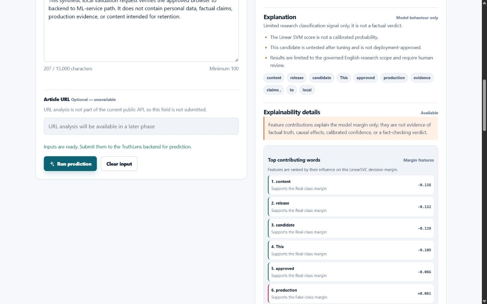
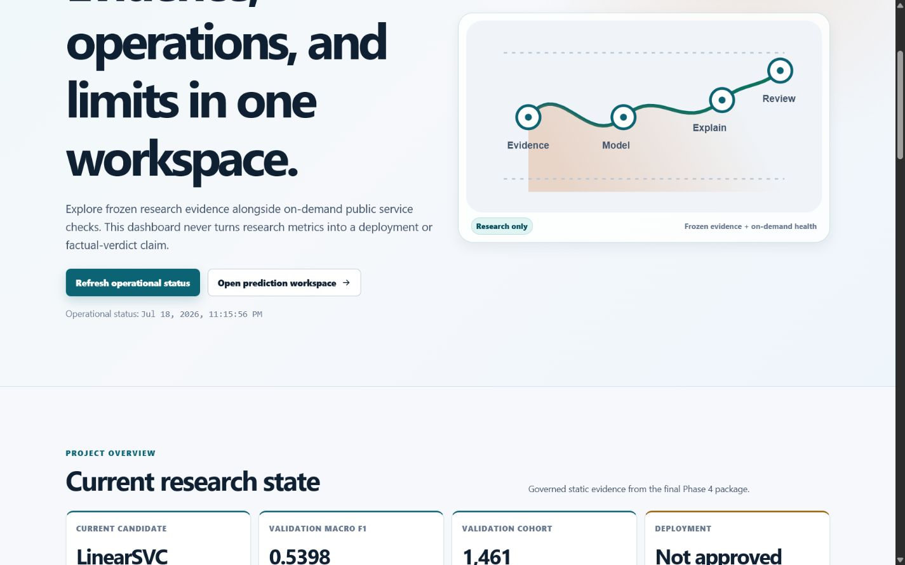
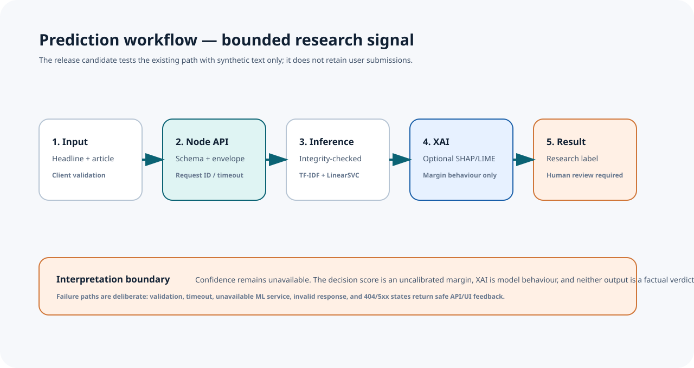

# TruthLens AI

TruthLens AI is a research-oriented platform for transparent fake-news classification research in Indian digital-media contexts. **Phase 5 is complete through `v1.0.0-RC1`.** This is a controlled integration release candidate for demonstration and deployment-readiness validation—not a public production release or model deployment approval.

> The current `TL-LSVM-TFIDF-v1.1.0-rc.1` LinearSVC candidate is an internal research integration (`production_model=false`). It must not be described as a fact checker, factual-verdict tool, calibrated confidence system, autonomous moderation system, Hindi/Hinglish detector, or general Indian-media reliability assessor.

## Architecture


The browser uses a static frontend and calls only the public Node.js API. Node validates the contract, adds request correlation, and delegates to the private FastAPI ML service. FastAPI loads the integrity-checked model package and returns a bounded research prediction plus optional explainability metadata. There is no database, retention store, browser-to-ML connection, authentication layer, or telemetry platform in the approved architecture.

## Features

- Responsive, accessible dependency-free SPA with Home, Predict, Dashboard, Models, Research, About, placeholders, and not-found state.
- Validated headline/article prediction flow with loading, success, reset, error, timeout, offline, invalid-response, 404, and 5xx feedback.
- Honest model presentation: confidence is unavailable, decision score is an uncalibrated margin, and risk remains not assessed.
- Optional local SHAP/LIME model-margin explanation metadata with explicit interpretation limits.
- Industrial research dashboard with frozen validation evidence, accessible SVG charts, user-triggered API/ML/model health checks, and explicit no-retention/illustrative states.
- Route-level lazy loading, skeletons, visible focus states, reduced-motion support, safe DOM rendering, and responsive QA.

## Release-candidate visuals

| Prediction and explainability workflow | Dashboard operational health |
| --- | --- |
|  |  |

The screenshots use synthetic, non-sensitive input from the controlled local RC verification. They are UI evidence only; neither screenshot establishes factual truth, model reliability, or public-production readiness.



## Research status

| Evidence | Current state |
| --- | --- |
| Integrated candidate | `TL-LSVM-TFIDF-v1.1.0-rc.1`, TF-IDF unigram/bigram + LinearSVC; internal research only |
| Frozen validation | Macro F1 `0.5398`; MCC `0.1014`; FAKE recall `0.3183` |
| Best alternative | Hard/weighted ensemble Macro F1 `0.5447`, within the `0.005` practical-tie tolerance; not integrated |
| Confidence | Unavailable; the margin is not calibrated probability |
| Explainability | Bounded SHAP/LIME evidence of model-margin behaviour, not factual evidence |
| Transformers | No completed metric: access/resource limited |
| Multilingual | Unicode compatibility only; no validated Hindi/Hinglish performance |
| Deployment | Blocked pending governed data, post-tuning evaluation, calibration, robustness/fairness, rights, monitoring, and human-review evidence |

Read the [Model Card](docs/research/MODEL_CARD.md), [Model Registry](docs/research/MODEL_REGISTRY.md), [Research Decision Log](research/decision-log/README.md), and [known limitations](docs/releases/KNOWN_LIMITATIONS.md) before relying on any output.

## Installation

### Prerequisites

- Node.js `>=20.18.0`
- Python compatible with `ml-service/requirements.txt`
- The governed internal model package available at the configured package path

### Configure local services

```powershell
Copy-Item backend/.env.example backend/.env
Copy-Item ml-service/.env.example ml-service/.env
```

The frontend configuration in `frontend/public/config.js` is public. Point `apiBaseUrl` at the Node API and never add tokens, credentials, model secrets, or private service URLs to it.

### Install runtime dependencies

```powershell
cd backend
pnpm install

cd ../ml-service
python -m venv .venv
.\.venv\Scripts\python.exe -m pip install -r requirements.txt
```

Use the package manager/runtime approved by your environment. Do not commit `node_modules`, virtual environments, `.env` files, model packages, logs, or raw/derived data.

## Usage

Start the private ML service, then the public Node API, then a static frontend server in separate terminals:

```powershell
# ML service
cd ml-service
.\.venv\Scripts\python.exe -m uvicorn main:app --host 127.0.0.1 --port 8000

# Node API
cd backend
node src/server.js

# Static frontend from repository root
python -m http.server 4173 --directory frontend
```

Open `http://127.0.0.1:4173/#/predict` or `#/dashboard`. Run the RC verifier against the started Node API with synthetic input only:

```powershell
.\ml-service\.venv\Scripts\python.exe scripts\release\verify_release_candidate.py --backend-url http://127.0.0.1:3000
```

## Configuration and deployment

- [Release-candidate deployment guide](docs/deployment/RELEASE_CANDIDATE_DEPLOYMENT.md)
- [Production integration guide](docs/production/PRODUCTION_DEPLOYMENT_GUIDE.md)
- [Production checklist](docs/production/PRODUCTION_CHECKLIST.md)
- [Service integration](docs/production/SERVICE_INTEGRATION.md)
- [Release notes](docs/releases/RELEASE_NOTES_v1.0.0-RC1.md)
- [Final QA report](docs/releases/FINAL_QA_REPORT.md)

Deployment requires a hosting-owned HTTPS/reverse proxy, exact CORS origins, private ML-service network access, CSP/security headers, rate limiting, monitoring/privacy policy, rollback procedure, and incident response. The repository does not provide infrastructure-as-code, containers, a database, or a public-release approval.

## API documentation

The public contract is `POST /api/predict`; the browser never calls Python directly. Successful responses use a standard envelope with a `request_id`. Prediction fields retain `confidence: null`, `confidence_status: "unavailable"`, `risk_level: "not_assessed"`, and the uncalibrated `decision_score`.

- [Prediction API](docs/api/Prediction-API.md)
- [Production API reference](docs/production/API_REFERENCE.md)
- [Shared contracts](shared/contracts/README.md)

## Documentation

### Frontend

- [Frontend documentation index](docs/frontend/README.md)
- [Accessibility guide](docs/frontend/ACCESSIBILITY_GUIDE.md)
- [Performance optimization](docs/frontend/PERFORMANCE_OPTIMIZATION.md)
- [UX review](docs/frontend/UX_REVIEW.md)
- [Responsiveness report](docs/frontend/RESPONSIVENESS_REPORT.md)
- [Frontend hardening](docs/frontend/FRONTEND_HARDENING.md)
- [Frontend QA](docs/frontend/QUALITY_ASSURANCE.md)

### Research and governance

- [Phase 5 summary](docs/PHASE5_SUMMARY.md)
- [Phase 4 summary](docs/PHASE4_SUMMARY.md)
- [Project research summary](docs/research/PROJECT_RESEARCH_SUMMARY.md)
- [Experiment Registry](docs/research/EXPERIMENT_REGISTRY.md) and [Model Registry](docs/research/MODEL_REGISTRY.md)
- [Engineering Journal](docs/engineering-journal/README.md), [ADRs](docs/adr/README.md), and [RDL](research/decision-log/README.md)
- [Release documentation](docs/releases/README.md)
- [Visual asset inventory](docs/assets/release-candidate/README.md)

## Phase 5 milestones

| Milestone | Outcome |
| --- | --- |
| 5.1 | Professional UI/UX foundation: design system, reusable components, responsive app shell, prepared routes, and frontend documentation. |
| 5.2 | Prediction and explainability workspace: validated existing-API workflow, governed model trace, unavailable confidence, and bounded XAI visualization. |
| 5.3 | Industrial analytics dashboard: evidence-aware charts, on-demand public status checks, no-retention state, and original SVG assets. |
| 5.4 | Frontend UX, performance, accessibility, responsiveness, security, and maintainability hardening. |
| 5.5 | Controlled RC validation, release/deployment/QA documentation, original diagrams, local visual evidence, and repository-quality review. |

## Future roadmap

Phase 6 requires separate approval and governed evidence for new data, post-tuning protected evaluation, calibration, robustness/fairness/generalization, multilingual validation, human review, deployment security infrastructure, and public-release governance. See the [release roadmap](docs/releases/ROADMAP.md) and [publication future work](docs/research/publication/FUTURE_WORK.md).

## License and acknowledgements

TruthLens AI is licensed under the [MIT License](LICENSE). The repository acknowledges the research contributors, the documented BFNK-derived governed dataset lineage, and the open-source communities behind Node.js, Express, FastAPI, scikit-learn, SHAP, LIME, spaCy, and the browser/platform standards used by the project. Consult the data and research documentation for scope, rights, and attribution boundaries.
