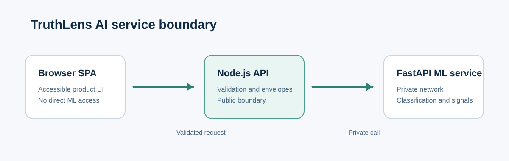

# TruthLens AI

TruthLens AI is an open-source, AI-assisted fake-news detection system. It accepts a headline and article, returns an automated `Real` or `Fake` classification, and can show the text features that contributed to that result. It is designed to support thoughtful content review—not to replace independent verification.

## Features

- Accessible, responsive single-page interface.
- Validated headline and article submission flow.
- Node.js API boundary with standardized success and error envelopes.
- Python ML service for automated classification.
- Optional explainability details for individual predictions.
- On-demand backend and ML-service health dashboard.
- Stateless v1.0.0 design: no accounts, history, or dashboard telemetry.

## Screenshots

| Landing | Prediction |
| --- | --- |
|  |  |

| Dashboard | Explainability |
| --- | --- |
|  |  |


## Architecture



The browser calls the Node.js backend only. The backend validates requests, provides consistent response envelopes, and calls the private FastAPI ML service. The ML service performs the automated analysis and can return feature-contribution details. v1.0.0 does not require a database.

See [the architecture guide](docs/architecture/SYSTEM_ARCHITECTURE.md) for component responsibilities.

## Installation

Prerequisites:

- Node.js 20.18 or later
- Python 3.11 or later
- A locally configured ML runtime package (see [configuration](#configuration))

Install the frontend and backend dependencies:

```powershell
pnpm install --dir frontend --ignore-scripts
pnpm install --dir backend --ignore-scripts
```

Create and activate a Python virtual environment, then install the ML-service requirements:

```powershell
py -3.11 -m venv .venv
.\.venv\Scripts\Activate.ps1
python -m pip install -r ml-service\requirements.txt
```

## Configuration

Copy the environment templates before changing local values:

```powershell
Copy-Item backend\.env.example backend\.env
Copy-Item ml-service\.env.example ml-service\.env
```

Important settings:

| Service | Setting | Purpose |
| --- | --- | --- |
| Frontend | `window.TruthLensConfig.apiBaseUrl` | Public backend URL, set in `frontend/public/config.js`. |
| Backend | `ML_SERVICE_URL` | Internal FastAPI service URL. |
| Backend | `CORS_ALLOWED_ORIGINS` | Comma-separated frontend origins. |
| ML service | `MODEL_PACKAGE_DIR` | Local path to the configured runtime package. |
| ML service | `MODEL_LOADING_MODE` | `lazy` for local development or `eager` for deployment checks. |

Keep `.env` files and runtime packages out of source control. They are ignored by default.

## Running Locally

Start each service in a separate terminal.

```powershell
# ML service
Set-Location ml-service
..\.venv\Scripts\python.exe -m uvicorn main:app --host 127.0.0.1 --port 8000
```

```powershell
# Node.js backend
Set-Location backend
pnpm start
```

```powershell
# Static frontend
Set-Location frontend
py -m http.server 4173
```

Open `http://127.0.0.1:4173`. The default frontend configuration calls the backend at `http://127.0.0.1:3000`.

## Deployment

Deploy the frontend as static files, run the backend as the only public API service, and keep the ML service on a private network. v1.0.0 is stateless and has no database dependency. See the [deployment guide](docs/deployment/DEPLOYMENT_GUIDE.md) for environment variables, network boundaries, health checks, and reverse-proxy guidance.

## API Documentation

The public API provides:

- `GET /api/health`
- `GET /api/system/health`
- `POST /api/predict`

See the [Prediction API reference](docs/api/PREDICTION_API.md) and the versioned schemas in [shared/contracts](shared/contracts/).

## Folder Structure

```text
frontend/       Static browser application
backend/        Express public API
ml-service/     FastAPI analysis service
shared/         Shared API contracts
docs/           Product, architecture, API, and deployment documentation
scripts/        Build and operational helper scripts
docker/         Reserved container deployment configuration
```

## Tech Stack

- Vanilla JavaScript, HTML, and CSS
- Node.js and Express
- Python, FastAPI, and Pydantic
- Optional SHAP and LIME explainability integrations
- JSON Schema and Zod request/response validation

## Usage

1. Open **Predict**.
2. Enter a headline and at least 100 characters of article text.
3. Select **Analyze content**.
4. Review the classification and contributing words.
5. Verify important claims with reliable, independent sources.

## Future Enhancements

- Source and URL analysis.
- Optional user preferences with explicit privacy controls.
- Authenticated, consent-based usage history.
- Deployment observability and alerting.
- Broader language support with product-quality validation.

## License

Distributed under the [MIT License](LICENSE).

## Contributing

Contributions are welcome. Please read [CONTRIBUTING.md](CONTRIBUTING.md) and keep pull requests focused, tested, and free of sensitive information.

## Acknowledgements

TruthLens AI uses open-source software from the JavaScript and Python ecosystems, including Express, FastAPI, Pydantic, SHAP, and LIME.
