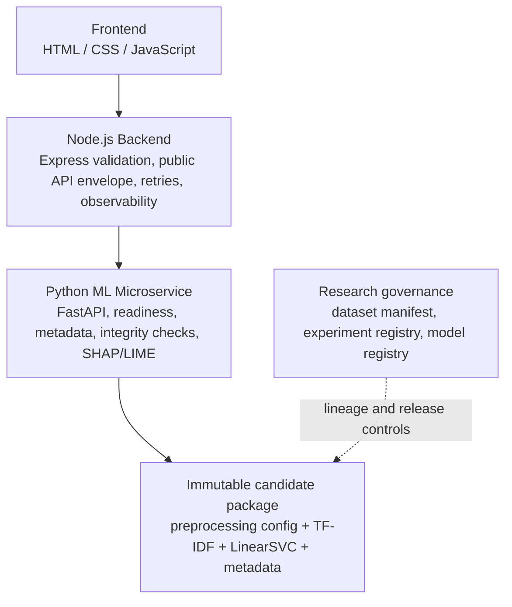

# Final System Architecture

TruthLens AI retains its established three-layer architecture.

The browser has no direct model-service access. The backend is the public trust boundary. The Python service owns versioned inference package loading and in-process explanation generation; it does not train or select models. Governance artifacts bind the package to its frozen dataset, configuration, experiment evidence, and train-only XAI report. The package's current status is integration-only, not deployment-approved.
