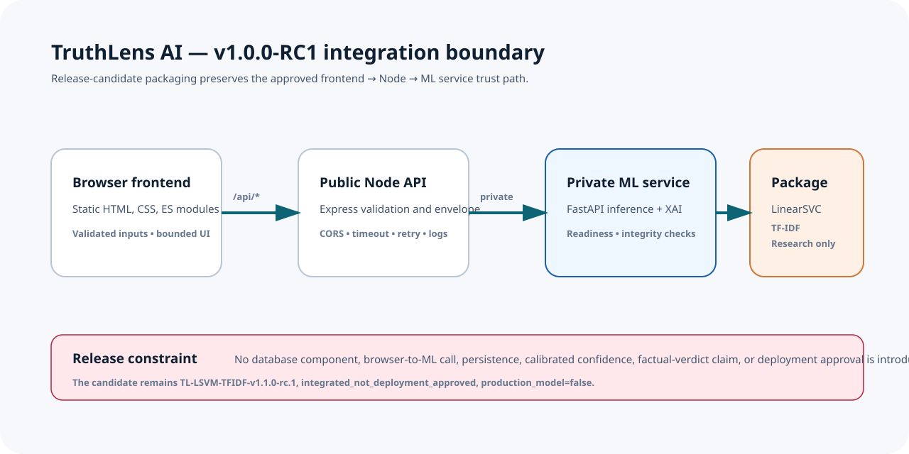

# Release Candidate Deployment Guide — v1.0.0-RC1

## Release status and boundary

`v1.0.0-RC1` is an integration and documentation release candidate, not a public production release. It packages the existing static frontend, Node public API, private FastAPI ML service, and integrity-checked `TL-LSVM-TFIDF-v1.1.0-rc.1` package for controlled deployment validation.

The candidate remains `production_model=false` and `integrated_not_deployment_approved`. It is not a fact checker, calibrated-confidence system, Hindi/Hinglish classifier, autonomous moderation service, or general Indian-media reliability assessor. The release process must not expose it publicly until the separate research and governance gates in [known limitations](../releases/KNOWN_LIMITATIONS.md) are resolved.

## Topology



- Serve the frontend as static files over HTTPS.
- Expose only the Node.js `/api/*` origin to the browser.
- Keep the Python ML service private to the backend network.
- Mount the versioned model package read-only and verify readiness before accepting traffic.
- No database, prediction retention, metrics store, user account, or telemetry service is implemented by this repository.

## Prerequisites

- Node.js `>=20.18.0` for the backend and frontend checks.
- Python environment compatible with `ml-service/requirements.txt`.
- The governed candidate package at the configured `MODEL_PACKAGE_DIR`.
- A reverse proxy/TLS termination, firewall policy, and process supervisor owned by the deployment environment.

## Environment configuration

Copy each example file outside source control and set deployment-specific values:

```powershell
Copy-Item backend/.env.example backend/.env
Copy-Item ml-service/.env.example ml-service/.env
```

| Service | Required operational configuration |
| --- | --- |
| Frontend | `window.TruthLensConfig.apiBaseUrl` must point to the HTTPS Node public API. Do not put tokens or secrets in `frontend/public/config.js`. |
| Node API | Set `NODE_ENV=production`, a private `ML_SERVICE_URL`, exact `CORS_ALLOWED_ORIGINS`, bounded timeout/retry values, request-body limit, and `SERVICE_VERSION=1.0.0-RC1` for the candidate deployment. |
| ML service | Set `ML_SERVICE_ENV=production`, `MODEL_LOADING_MODE=eager`, an immutable read-only `MODEL_PACKAGE_DIR`, and an explicit `ML_SERVICE_VERSION`. |

The example CORS origins are local-development values only. CORS is a browser policy, not authentication; restrict network access separately. Keep `.env` files, model packages, raw data, logs, and runtime uploads outside Git.

## Controlled startup

1. Install the Python dependencies in the service environment and start the ML service on a private interface.
2. Wait for its process health, then `GET /ready`; a package failure must keep it not ready.
3. Install Node dependencies and start the backend with its production environment. Confirm `/api/health`, `/api/system/health`, `/api/model/ready`, `/api/model/version`, and `/api/model/metadata`.
4. Deploy the static frontend with its public runtime configuration and configure the exact frontend origin in `CORS_ALLOWED_ORIGINS`.
5. Run the synthetic verification command below from the controlled environment.
6. Only then permit the approved internal RC audience to access the frontend. Do not label this as public production deployment.

```powershell
& .\ml-service\.venv\Scripts\python.exe scripts\release\verify_release_candidate.py --backend-url https://api.example.internal
```

The verifier sends one synthetic, non-sensitive prediction request; it checks only the existing public API contract, readiness endpoints, explainability metadata status, unavailable confidence, non-assessed risk, and model version. It does not test a database because no database is part of the architecture.

## Operational readiness

- Capture structured logs without headline/article text; retain only approved metadata.
- Monitor readiness, response latency, timeouts, 5xx/502/503/504 rates, and model/package version consistency.
- Configure HTTPS, a reviewed Content Security Policy, security headers, a reverse-proxy request limit, private ML network access, and rate limiting before any exposed environment.
- Define backup/rollback and incident-response procedures in the hosting platform. The repository has no infrastructure-as-code, container manifests, database migration, or telemetry deployment; these remain deployment-owner responsibilities.

## Rollback

Stop public/internal routing to the RC frontend and Node API if model readiness fails, the package manifest does not verify, the synthetic smoke test fails, the model version differs, or any governance boundary is breached. Roll back only to a previously approved, immutable internal integration artifact; never silently substitute a mock model or mutate a package in place.
