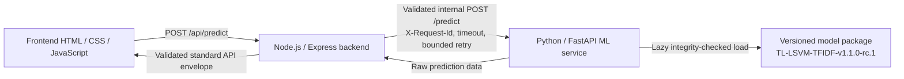

# Service Integration

## Final request path

The frontend never calls the Python service directly. Node owns the public envelope, validates user input and Python output, correlates request IDs, maps timeouts/unavailability to safe public errors, and keeps request text out of logs.

## Python service

- Development/testing default to lazy loading. `/health` reports process health without loading the model; `/ready`, `/metadata`, and `/predict` require a valid package. Production defaults to eager loading so package validation finishes before the service is advertised as ready.
- `MODEL_LOADING_MODE=eager` attempts a load during startup. A package failure is logged safely and keeps readiness false instead of serving predictions with a fallback model. A deployment must allow enough readiness time for cold package/spaCy loading rather than treating it as a request-timeout failure.
- Inference preserves the frozen research composition: `headline + "\n\n" + article`, then the packaged conservative preprocessing policy and frozen TF-IDF/LinearSVC pipeline. Phase 4.1 reuses that same processed text and TF-IDF row for SHAP; LIME perturbs the processed text through the same vectorizer/classifier without rerunning request preprocessing.
- Logs are JSON events containing request ID, lengths, label, latency, model version, status, and `confidence_status`; they never include headline or article text.
- Explanation failures are privacy-safe: the prediction still returns, explanation metadata is marked unavailable, and logs contain only the error type and request metadata.

## Node service

Node uses `MlServiceClient` for `/predict`, `/health`, `/ready`, `/metadata`, and `/version`, with configured URL, timeout, retry count, and retry delay. `MODEL_STARTUP_TIMEOUT_MS` is intentionally separate from `REQUEST_TIMEOUT_MS` so a cold, integrity-checked model load does not look like a normal inference timeout. It validates every successful prediction and model endpoint response before returning it. Python non-success payload codes are retained when safe, rather than being collapsed into an ambiguous error.

`EMPTY_PROCESSED_INPUT` and input validation failures map to `422`; timeouts map to `504`; invalid upstream output maps to `502`; unavailable or unready service maps to `503`.
