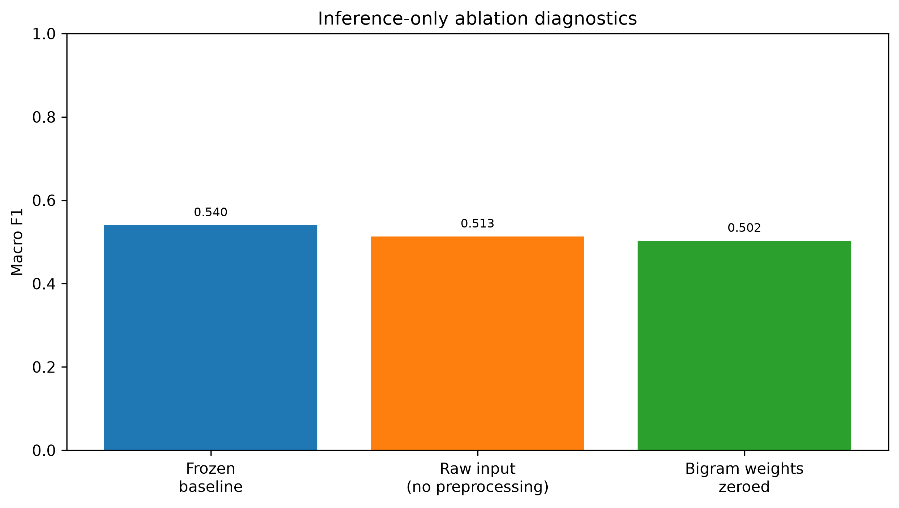

# Ablation Study - Phase 4.5

## Design

The model cannot be retrained or feature-refit under RDL-011. Phase 4.5 therefore uses inference-only diagnostics rather than conventional retrained ablations. Each diagnostic uses the frozen validation labels only for descriptive comparison and cannot select a model.

| Variant | Accuracy | Macro F1 | MCC | Interpretation |
| --- | ---: | ---: | ---: | --- |
| Frozen baseline | 0.5941 | 0.5398 | 0.1014 | Approved preprocessing and unigram/bigram TF-IDF |
| Raw input, no preprocessing | 0.5825 | 0.5127 | 0.0599 | Existing vectorizer receives raw text; an input-contract stressor, not a new model |
| Bigram weights zeroed | 0.5866 | 0.5024 | 0.0560 | Existing bigram coefficient influence removed without refitting |

Removing frozen preprocessing reduces Macro F1 by 0.0271; zeroing bigram influence reduces it by 0.0374. These differences suggest both components contribute to the observed validation behaviour, but they are not causal estimates from retrained models.

The SHAP/LIME module is not ablated because it runs after prediction and cannot alter the classifier margin or label by architecture. Phase 4.3 ensembles remain comparison-only challengers (best Macro F1 0.5447); Phase 4.2 transformers remain not evaluated because no completed checkpoint/prediction artifact exists.
