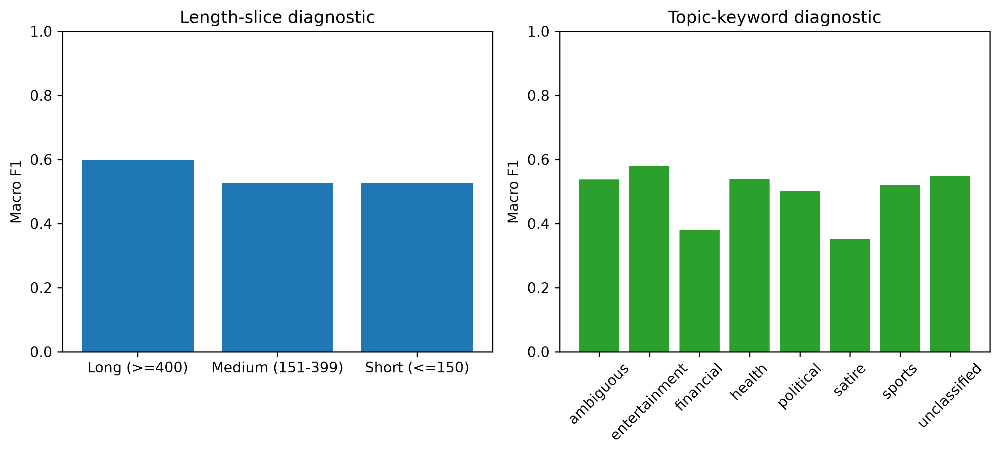

# Bias and Fairness Analysis - Phase 4.5

## Scope

This is a descriptive group-performance analysis, not a demographic fairness assessment. The derivative has fact-check-source metadata, heuristic topic/language appearance, and text length; it has no protected demographic attributes, publisher identity, ground-truth topic taxonomy, or causal exposure data. Groups overlap and must not be interpreted as communities or protected classes.

## Findings

| Slice | Support | Macro F1 | MCC | Reading limit |
| --- | ---: | ---: | ---: | --- |
| Short (0–150 chars) | 185 | 0.5264 | 0.1150 | Descriptive length slice |
| Medium (151–399 chars) | 1,088 | 0.5263 | 0.0704 | Descriptive length slice |
| Long (400+ chars) | 188 | 0.5975 | 0.2120 | Higher result; not independent validation |
| Political keyword | 391 | 0.5022 | 0.0230 | Overlapping English-keyword heuristic |
| Health keyword | 195 | 0.5390 | 0.1012 | Overlapping English-keyword heuristic |
| Financial keyword | 39 | 0.3810 | -0.2107 | Small sample; signal warrants future review |
| English/unclassified appearance | 1,450 | 0.5397 | 0.1021 | Majority English derivative slice |
| Devanagari-bearing appearance | 9 | 0.5846 | 0.1890 | Not a Hindi benchmark |
| Hinglish heuristic | 2 | Not computable | Not computable | Both records are REAL-labelled |

Across fact-check-source groups with at least 20 records, Macro F1 ranges from 0.3913 to 0.7576 (range 0.3663). The range signals source/template sensitivity and uneven support, not a publisher-fairness conclusion: `fact_check_source` is a fact-check source proxy, not the originating publisher, and group composition differs.

## Responsible interpretation

Financial, political, source, and language-appearance variation should guide future data collection and error review. They do not establish systematic discrimination, parity, or causal bias. Any consequential deployment would require a governed fairness design with appropriate attributes, annotations, sufficiently powered cohorts, rights review, and human oversight.
