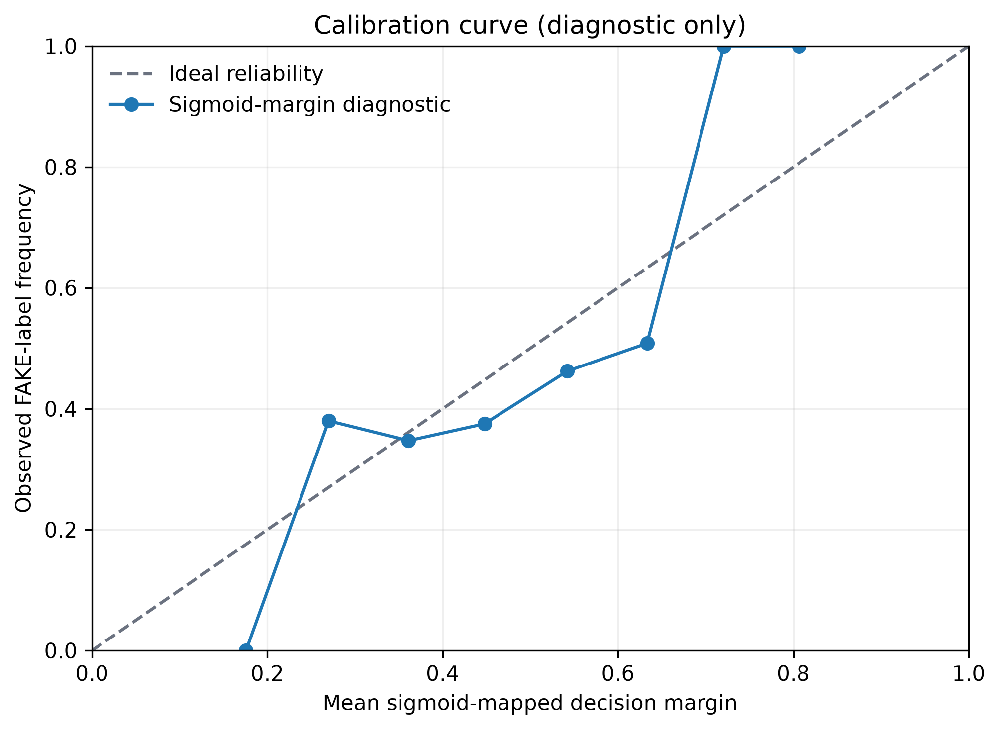
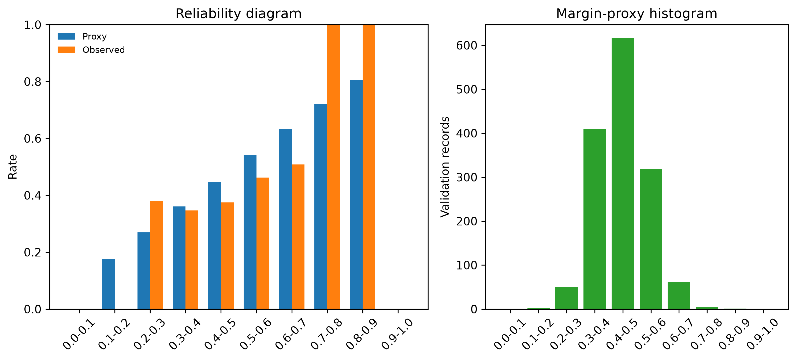

# Calibration Analysis - Phase 4.5

## Status

The LinearSVC exposes an uncalibrated decision margin and the API correctly keeps `confidence` unavailable. RDL-011 prohibits calibration fitting in this milestone. Accordingly, Phase 4.5 does **not** report a confidence calibration result or add a probability output.

For an explicitly non-fitted diagnostic only, the audit applies a clipped sigmoid to the existing margin. No validation labels are used to learn a mapping. The resulting proxy has ECE 0.0620 and Brier score 0.2395 on the frozen validation partition. These are diagnostic properties of an arbitrary monotonic margin mapping, not calibrated-probability or confidence metrics.

## Interpretation

The diagrams show that observed FAKE-label frequency differs from the sigmoid-mapped margin in several populated bins. More importantly, the mapping has no learned calibration guarantee. Neither the ECE proxy nor the Brier proxy can be used to threshold cases, rank human-review priority, claim confidence, or approve deployment. A future calibrated release requires a new governed dataset/model version, independently planned calibration data, reproducibility evidence, and release review.
