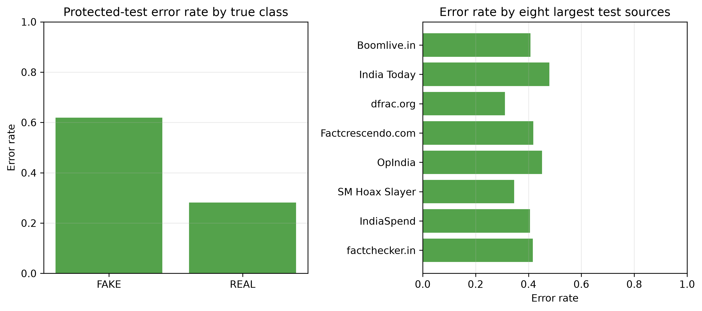

# Phase 3.8 Error Analysis

**Scope:** One-time protected-test predictions from the selected Linear SVM. No article text is reproduced in this report.

## Class-based findings

| True class | Test records | Errors | Error rate |
| --- | ---: | ---: | ---: |
| REAL | 885 | 249 | 28.14% |
| FAKE | 573 | 355 | **61.95%** |

The baseline misses a large majority of FAKE records. This confirms that the modest overall accuracy is not a sufficient indicator of fake-news-detection utility.

## Source and length slices

Among the largest test sources, error rates range from 31.13% for dfrac.org (151 records) to 47.89% for India Today (332 records). Boomlive.in has 40.72% error over 334 records and Factcrescendo.com has 41.86% over 129. Several sources have 30 or fewer test records; their rates are descriptive only and must not be used for source ranking.

Most test inputs are under 500 raw characters (1,437 records, 41.61% error). The 500–1,499-character slice contains only 21 records. This dataset's fact-check statement/body unit is generally short, so length-based conclusions are limited.

## Misclassification review policy

The governed evaluation artifact records only document IDs, true/predicted labels, source, and length bucket for individual errors. It deliberately excludes raw articles/claims from reports. Qualitative review, if approved later, must be access-controlled, use a documented sample, and distinguish dataset annotation/template effects from factual validity.

## Risk conclusion

The error asymmetry, source variation, short text units, and source-derived templates are material threats to validity. They rule out deployment and require robustness-focused evaluation in the next approved research milestone.

