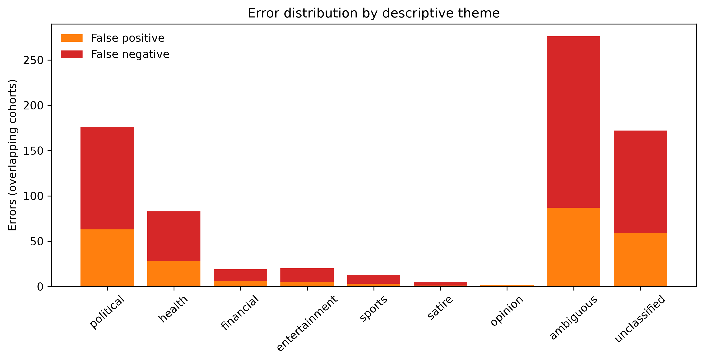

# Error Analysis Report - Phase 4.5

## Baseline error burden

On the frozen validation partition, the champion produces 201 false positives and 392 false negatives. The error asymmetry remains material: the FAKE-class recall is 0.3183 and FAKE-class F1 is 0.3816. This is a bounded classification error analysis, not a factual assessment of individual claims.

| Descriptive theme | False positives | False negatives | Support/interpretation limit |
| --- | ---: | ---: | --- |
| Political | 63 | 113 | Keyword heuristic; overlaps other themes |
| Health | 28 | 55 | Keyword heuristic; overlaps other themes |
| Financial | 6 | 13 | Only 39 matched records |
| Entertainment | 5 | 15 | Only 53 matched records |
| Sports | 3 | 10 | Only 33 matched records |
| Satire | 1 | 4 | Only 11 matched records |
| Opinion | 2 | 0 | Only 5 matched records; no binary metric |
| Ambiguous reporting | 87 | 189 | Overlapping uncertainty-language heuristic |
| Unclassified | 59 | 113 | No listed keyword matched |

## Error themes and causes

The highest observed false-negative counts appear in ambiguous and political keyword cohorts, consistent with the overall tendency to miss FAKE-labelled examples. Financial and satire slices have weak or negative MCC, but are too small for a reliable category conclusion. Title/length alteration and capitalization stressors also change predictions substantially, indicating reliance on surface-form features. Raw records and identifiers are excluded from the tracked report.

Future review should use a rights-approved, human-annotated taxonomy for claim type, satire, opinion, source context, and linguistic form instead of keyword proxies.
