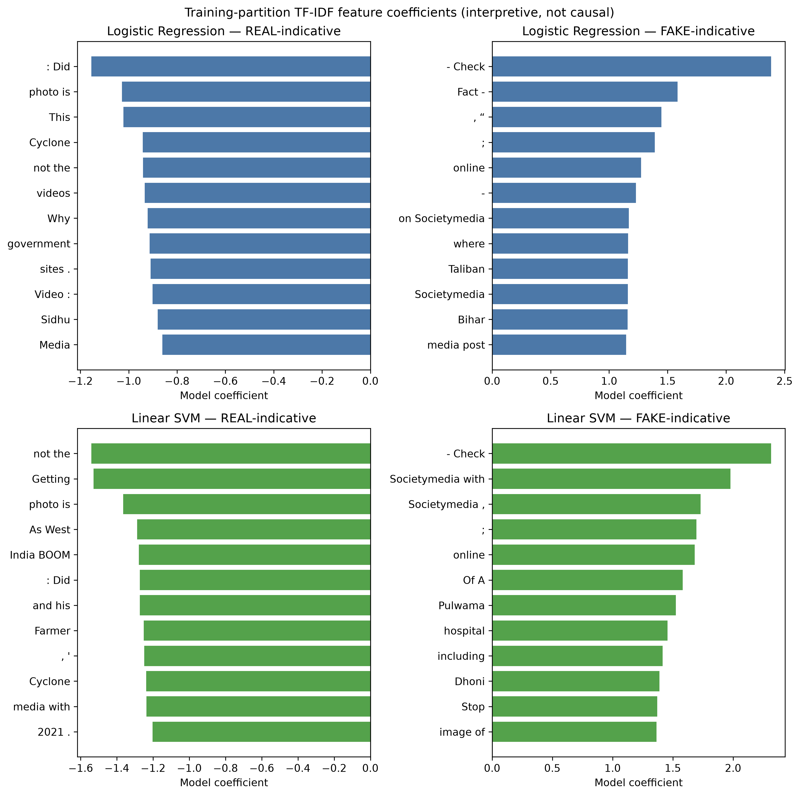

# Phase 3.8 Feature Importance Analysis

## Method

For Logistic Regression and Linear SVM, ranked TF-IDF coefficients were extracted after fitting on the frozen training partition. Positive coefficients are associated with the FAKE label and negative coefficients with REAL under `LMAP-BFNK-v1.0`. Coefficients describe this dataset/model relationship only; they are not evidence that a phrase is true, false, causal, or safe to show to users as an explanation.

## Observations

High-magnitude FAKE-associated features include `- Check`, `Fact -`, and social-media/template forms such as `Societymedia with`. REAL-associated features include generic narrative fragments such as `not the`, `Getting`, and `photo is`. The prominence of fact-check/template-like tokens is a warning that source format and annotation style may contribute to the learned signal.

The previously observed literal `nan` token was traced to spreadsheet missing-cell conversion and removed in corrected derivative r2; it is not present in this final feature analysis. Remaining encoding-like tokens are retained as a documented raw-data quality limitation, not silently repaired in this milestone.

## Use constraints

- Coefficients are an aggregate diagnostic, not a user-facing explanation feature.
- The result cannot support claims about factual truth, source trustworthiness, or causal linguistic markers.
- Any later explanation interface requires a separate safety, faithfulness, and user-study decision.

