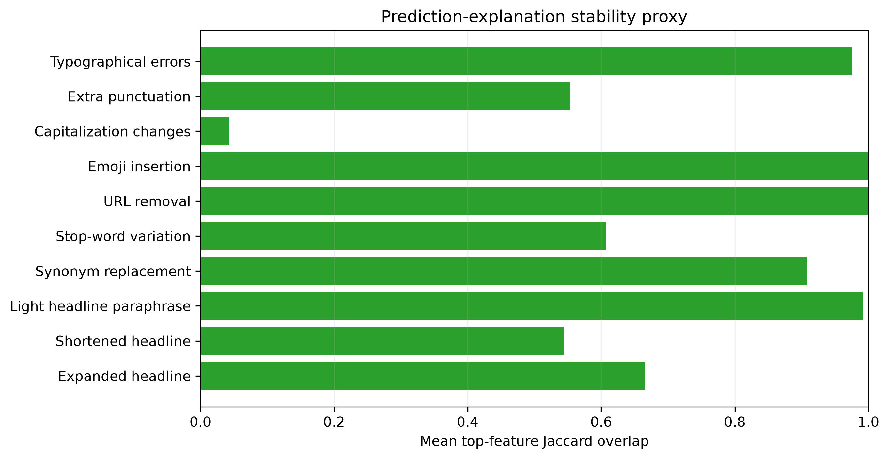

# Reliability Assessment - Phase 4.5

## Overall assessment

The current model has limited, reproducible English validation evidence but does not meet reliability requirements for deployment. Baseline Macro F1 is 0.5398, MCC is 0.1014, and FAKE recall is 0.3183. The model accepts all audited inputs under its frozen preprocessing but is not reliably invariant to several realistic surface changes.

## Strengths

- Integrity-checked package, frozen lineage, deterministic aggregate audit, and bounded SHAP/LIME explanations are in place.
- Emoji insertion did not change predictions in this stress test; the fixed typo map caused 1.1% flips where touched.
- Long-form validation records have stronger descriptive Macro F1 (0.5975) than short/medium cohorts (about 0.5264).

## Failure modes

- Capitalization changes flip 29.0% of validation predictions and reduce synthetic-stress Macro F1 to 0.4520.
- Appending neutral context flips 27.0%; shortening text flips 14.4%; stop-word deletion flips 11.6%.
- The uncalibrated margin has no confidence meaning. Sigmoid-margin ECE/Brier values are diagnostics only, not calibration evidence.
- Source/topic/temporal-appearance differences and sparse multilingual evidence prevent a fairness or generalization claim.

## Deployment implication

The model remains unsuitable for automated fact checking, factual verdicts, reliability scoring, risk scoring, or autonomous moderation. It should not be deployed without a new governed data/model release, calibration plan, external and multilingual evaluation, robustness remediation/measurement, rights review, monitoring, and meaningful human-review controls. Phase 4.5 does not promote any model or change the architecture.
