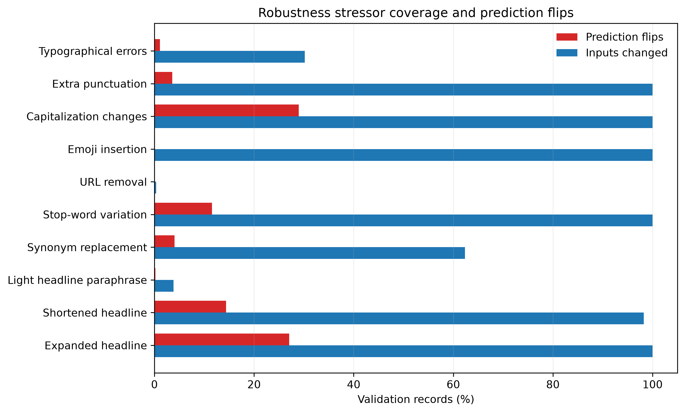
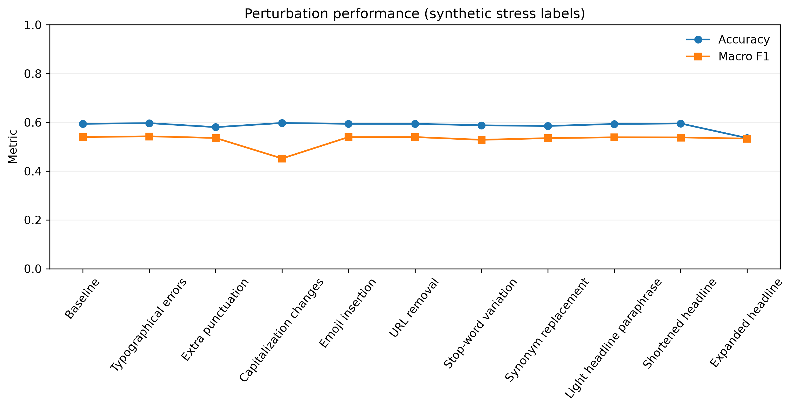

# Robustness Evaluation - Phase 4.5

**Status:** Complete, validation-only research evidence.
**Decision authority:** [RDL-016](../../research/decision-log/RDL-016-Robustness-Reliability-and-Fairness-Boundary.md).
**Aggregate artifact:** ignored `P45-reliability-assessment-20260718T140601Z`, code revision `d2a4f96`.

## Protocol

The integrity-checked packaged `TL-LSVM-TFIDF-v1.1.0-rc.1` and its frozen preprocessing processed the original validation records and ten deterministic text stressors. The full derivative SHA-256 and 6,813 / 1,461 / 1,458 split counts were verified; only validation records were retained in memory. No model was retrained, recalibrated, threshold-tuned, or promoted, and the protected test was not accessed.

Synthetic variants are not independently labelled corpora. The metric columns retain the original label only as a stress diagnostic. Mechanical changes have a stronger label-preservation assumption than synonym, paraphrase, shortening, and expansion changes; none may support a deployment or model-selection conclusion.

## Results

Baseline validation Macro F1 is 0.5398. Flip rate is the percentage whose predicted label changed relative to the frozen baseline.

| Stressor | Inputs changed | Flip rate | Macro F1 | Accuracy | Interpretation |
| --- | ---: | ---: | ---: | ---: | --- |
| Typographical errors | 30.2% | 1.1% | 0.5429 | 0.5969 | Limited fixed misspelling map; relatively stable where touched |
| Extra punctuation | 100.0% | 3.6% | 0.5360 | 0.5804 | Small but observable sensitivity |
| Capitalization changes | 100.0% | **29.0%** | **0.4520** | 0.5975 | Major label and feature instability |
| Emoji insertion | 100.0% | 0.0% | 0.5398 | 0.5941 | No measured effect in this fixed append-only test |
| URL removal | 0.3% (5 records) | 0.0% | 0.5398 | 0.5941 | Too little URL coverage for a broader conclusion |
| Stop-word variation | 100.0% | 11.6% | 0.5284 | 0.5880 | Function-word removal changes the model input materially |
| Synonym replacement | 62.4% | 4.0% | 0.5353 | 0.5852 | Fixed lexical substitutions only |
| Light headline paraphrase | 3.8% | 0.2% | 0.5388 | 0.5934 | Sparse fixed phrase coverage limits interpretation |
| Shortened headline | 98.2% | 14.4% | 0.5383 | 0.5955 | Information removal can alter labels/margins |
| Expanded headline | 100.0% | **27.0%** | 0.5334 | **0.5359** | Neutral appended context is unexpectedly influential |

## Interpretation

The model is robust to the single emoji append and largely stable to the limited typo map, but it is not invariant to capitalization, input expansion, shortening, or stop-word deletion. These are model-behaviour observations, not evidence that a changed news claim has the same meaning or label. The results reinforce the current research-only, human-review, and non-deployment boundaries.
